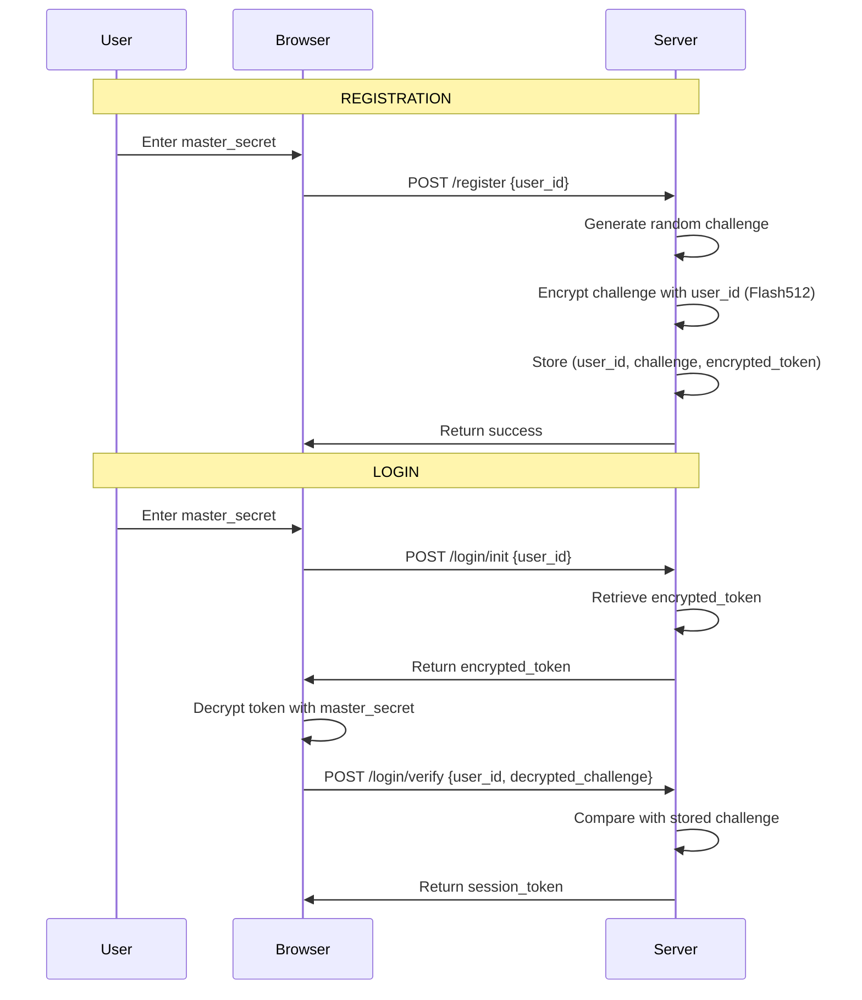

<div align="center">

# 

## _Zero-Knowledge-Inspired · Passwordless Authentication · Military-Grade Encryption_

**The Future of Authentication is Here. No Email. No Password. Just Your Secret.**

[](https://www.python.org/)
[](LICENSE)
[](https://pypi.org/project/cryptologin/)
[](https://github.com/erabytse/CryptoLogin)
[](SECURITY.md)
[](https://github.com/yourusername/cryptologin)

## The time is now ripe for it

**Stop storing password hashes. With CryptoLogin, the server only stores encrypted challenges. The master secret is used once at registration, then forgotten. At login, no secret ever crosses the network.**


CryptoLogin uses a challenge-response mechanism inspired by Zero-Knowledge principles.
The server never stores your secret. Your secret never leaves your device.

</div>

---

## 🚀 What is CryptoLogin?

**CryptoLogin** is a revolutionary **Passwordless Authentication without Password Storage** with a **Zero-Knowledge-Inspired architecture** that eliminates the need for emails, passwords, or social logins.

---

## What CryptoLogin REALLY is (and isn't)

### ❌ It is NOT "Zero-Knowledge" in the strict cryptographic sense

- In true Zero-Knowledge (like zk-SNARKs or Passkeys), the server never sees the secret, even during registration.
- Here, the `master_secret` is used to encrypt the challenge during registration.

### ✅ What it actually is

- A **Passwordless Authentication System with Encrypted Challenges**.
- The `master_secret` is **never stored** in the database.
- During login, no secret travels over the network.
- Security relies on the fact that **only the client can decrypt the `challenge_token`**.

### 🔐 Real-world security

If the database leaks, the attacker gets:

- `challenge_en_clair` (the "salt")
- `challenge_token` (the "hash")

To crack it, they must perform offline brute-force:

1. Guess a `master_secret`.
2. Derive the key with Argon2id.
3. Decrypt the `challenge_token` with AES-GCM.
4. Compare with `challenge_en_clair`.

**This is equivalent to cracking a password hash with a salt (like bcrypt/Argon2), but using our own elegant and secure mechanism powered by Flash512.**

---

## 🛡️ Powered by Flash512-Vanguard

CryptoLogin is built on top of [Flash512-Vanguard](https://github.com/erabytse/Flash512-vanguard), a military-grade encryption engine:

- **AES-256-GCM** - NIST standard encryption
- **Argon2id** - Memory-hard key derivation (GPU/ASIC resistant)
- **SecureBuffer** - Automatic memory wiping of sensitive data

Flash512 handles all cryptographic operations, ensuring that CryptoLogin inherits battle-tested security from one of the most robust encryption libraries available.

---

### 🚀 Why it's still revolutionary

- **One secret** for your entire digital life.
- **No email** required.
- **No OAuth** or social login.
- **Military-grade encryption**: AES-256-GCM + Argon2id + SecureBuffer.
- **Data Vault**: Your data is encrypted with your secret.

#

### The Problem

- 🔓 Passwords are **stolen** daily
- 📧 Email verification is **slow** and **annoying**
- 🕵️‍♂️ Social logins **track** your users
- 💰 Authentication services are **expensive**

### The Solution

- 🔐 **One Master Secret** - All you need to remember
- 🛡️ **Military-Grade Encryption** - AES-256-GCM + Argon2id
- 🚫 **Passwordless without password storage** - Your secret never leaves your device
- ⚡ **Lightning Fast** - Register in seconds

---

## ✨ Key Features

| Feature                         | Description                    | Security          |
| :------------------------------ | :----------------------------- | :---------------- |
| **Passwordless Authentication** | Server never knows your secret | 🔒 **Military**   |
| **No Email Required**           | Register without email         | 🔒 **Privacy**    |
| **No Password Required**        | Single master secret           | 🔒 **Simple**     |
| **AES-256-GCM**                 | NIST standard encryption       | 🔒 **FIPS**       |
| **Argon2id**                    | Memory-hard KDF                | 🔒 **OWASP**      |
| **SecureBuffer**                | Automatic memory wiping        | 🔒 **Military**   |
| **Data Vault**                  | Encrypted user data            | 🔒 **Zero-Trust** |
| **REST API**                    | FastAPI + OpenAPI              | 🔒 **Modern**     |
| **Rate Limiting**               | Brute-force protection         | 🔒 **Production** |

---

## 📦 Installation

```bash
# Install from PyPI
pip install cryptologin

# Or install from source
git clone https://github.com/erabytse/CryptoLogin.git
cd cryptologin
pip install -e .
```

## 🔒 Security Model

**CryptoLogin** uses a challenge-response mechanism with symmetric encryption (Flash512).

**Registration:**

1. User creates a `master_secret` (never leaves the client).
2. Client derives a `user_id` from the `master_secret` using Web Crypto API (PBKDF2-SHA512, 100k iterations).
3. Server generates a random `challenge` and encrypts it using Flash512 with the `user_id`.
4. Server stores the encrypted challenge (`challenge_token`) in the database.

**Login:**

1. User sends `user_id` to the server.
2. Server retrieves the `challenge_token` and sends it to the client.
3. Client decrypts the `challenge_token` with the `master_secret` to get the plaintext `challenge`.
4. Client sends the plaintext `challenge` back to the server.
5. Server verifies that the plaintext `challenge` matches the original challenge.

**The `master_secret` is never transmitted over the network.** Only the encrypted challenge and the derived `user_id` are exchanged.

### Why This Is Secure

- **Passwordless without password storage**: The server never sees the `master_secret`.
- **Military-Grade Encryption**: AES-256-GCM + Argon2id via Flash512.
- **Challenge-Response**: Each login uses a unique challenge (nonce).
- **Data Vault**: All user data is encrypted with the `master_secret`.

## 🏗️ Architecture



```text
┌─────────────────────────────────────────────────────────────────┐
│ CRYPTOLOGIN                                                     │
├─────────────────────────────────────────────────────────────────┤
│                                                                 │
│ [USER] → [API] → [UserManager] → [Data Vault] → [Storage]       │
│                                                                 │
│ 🔐 AES-256-GCM + Argon2id + SecureBuffer                       |
│ 🚫 Passwordless Authentication Architecture                    |
│ ⚡ FastAPI + SQLite/PostgreSQL                                 |
│                                                                 │
└─────────────────────────────────────────────────────────────────┘
```

✅ No Password Storage

The server never stores the master secret. Only encrypted challenges are stored.

✅ No Secret at Login

During login, the master secret never leaves the browser. Only the decrypted challenge is sent.

✅ Simple Architecture

No asymmetric keys, no WebAuthn complexity, no email verification. Just Flash512 encryption.

✅ Breach-Resistant

If the database is compromised, attackers only get encrypted challenges. They must brute-force each user individually.

# Powered by Flash512-Vanguard

Flash512-Vanguard is the cryptographic engine behind CryptoLogin. It provides:

- AES-256-GCM: NIST-standard authenticated encryption

- Argon2id: Memory-hard key derivation

- SecureBuffer: Automatic memory wiping

- Polymorphic encryption: Same data, different ciphertext each time

- Integrity verification: GCM authentication tags

By building on Flash512, CryptoLogin inherits enterprise-grade security without implementing cryptographic primitives from scratch.

## 🚀 Quick Start (V2 - Zero-Knowledge)

### Deployment Example (Web Application)

**Frontend (JavaScript):**

```javascript
import { deriveUserId } from "cryptologin-client";

async function login(masterSecret) {
  // 1. Derive user_id (CLIENT-SIDE)
  const userId = await deriveUserId(masterSecret);

  // 2. Get encrypted challenge from server
  const initResponse = await fetch("/auth/login/init_v2", {
    method: "POST",
    body: JSON.stringify({ user_id: userId }),
  });
  const { challenge } = await initResponse.json();

  // 3. Send the encrypted challenge back (DO NOT DECRYPT)
  const verifyResponse = await fetch("/auth/login/verify_v2", {
    method: "POST",
    body: JSON.stringify({
      user_id: userId,
      challenge_response: challenge,
    }),
  });

  return verifyResponse.json();
}
```

**Backend 🚀 EXAMPLE 1: FastAPI (Recommended)**

### Structure du projet

```text
myapp/
├── app.py                 # Application FastAPI
├── cryptologin.db         # SQLite database (created automatically)
├── .env                   # Environment variables
└── requirements.txt
```

### requirements.txt

```text
fastapi==0.104.0
uvicorn[standard]==0.24.0
cryptologin>=2.1.0
python-dotenv==1.0.0
```

### .env

```env
CRYPTOLOGIN_SECRET_KEY=your-super-secret-key-change-in-production-32-chars-min
FLASH512_VANGUARD_CORE=your-flash512-core-secret-64-chars-min
DATABASE_URL=sqlite:///cryptologin.db
```

### app.py

```python
"""
CryptoLogin – Example of integration with FastAPI
"""

import os
import logging
from datetime import datetime
from typing import Optional
from contextlib import asynccontextmanager

from fastapi import FastAPI, HTTPException, status, Depends
from fastapi.middleware.cors import CORSMiddleware
from pydantic import BaseModel, Field
from dotenv import load_dotenv

# Import CryptoLogin
from cryptologin import CryptoLogin
from cryptologin.core.user_manager_v2 import UserManagerV2
from cryptologin.storage.sqlite_v2 import SQLiteStorageV2
from cryptologin.client.crypto_client import CryptoClient

# Load environment variables
load_dotenv()

# Logging configuration
logging.basicConfig(
    level=logging.INFO,
    format="%(asctime)s - %(name)s - %(levelname)s - %(message)s"
)
logger = logging.getLogger(__name__)


# ============================================================
# PYDANTIC MODELS
# ============================================================

class RegisterRequest(BaseModel):
    """Application for registration V2."""
    user_id: str = Field(..., description="User ID derived from the master_secret (64 hex characters)")
    user_data: Optional[dict] = Field(default=None, description="User data")


class LoginInitRequest(BaseModel):
    """Request to initiate login."""
    user_id: str = Field(..., description="User ID")


class LoginVerifyRequest(BaseModel):
    """Request for login verification."""
    user_id: str = Field(..., description="User ID")
    challenge_response: str = Field(..., description="Numerical challenge (reposted as is)")


class AuthResponse(BaseModel):
    """Authentication response."""
    authenticated: bool
    user_id: str
    session_id: str
    expires_at: datetime
    message: str


class MessageResponse(BaseModel):
    """Replying to a simple message."""
    message: str
    success: bool
    data: Optional[dict] = None


# ============================================================
# LIFESPAN
# ============================================================

@asynccontextmanager
async def lifespan(app: FastAPI):
    """Application lifecycle management."""
    logger.info("🚀 Starting CryptoLogin FastAPI example...")

    # Initialise the database
    db_path = os.getenv("DATABASE_URL", "sqlite:///cryptologin.db").replace("sqlite:///", "")
    storage = SQLiteStorageV2(db_path=db_path, auto_migrate=True)
    app.state.storage = storage

    # Initialise UserManager V2
    app.state.user_manager = UserManagerV2(storage=storage, session_duration_hours=24)

    logger.info(f"✅ Database initialized at: {db_path}")
    logger.info("✅ CryptoLogin ready!")

    yield

    logger.info("👋 Shutting down CryptoLogin FastAPI example...")


# ============================================================
# APPLICATION FASTAPI
# ============================================================

app = FastAPI(
    title="CryptoLogin Example API",
    description="Passwordless Authentication with Zero-Knowledge-Inspired Architecture",
    version="2.1.0",
    lifespan=lifespan
)

# CORS (for development)
app.add_middleware(
    CORSMiddleware,
    allow_origins=["*"],
    allow_credentials=True,
    allow_methods=["*"],
    allow_headers=["*"],
)


# ============================================================
# ROUTES
# ============================================================

@app.get("/")
async def root():
    """Root of the API."""
    return {
        "name": "CryptoLogin Example API",
        "version": "2.1.0",
        "docs": "/docs",
        "status": "running"
    }


@app.post("/auth/register", response_model=MessageResponse)
async def register(request: RegisterRequest):
    """
    Register a new user.

    The client must derive the `user_id` from the `master_secret` before calling this route.
    The server NEVER sees the `master_secret`.
    """
    try:
        user_manager: UserManagerV2 = app.state.user_manager

        user_id = user_manager.register_user_v2(
            request.user_id,
            request.user_data or {}
        )

        return MessageResponse(
            message="User registered successfully",
            success=True,
            data={"user_id": user_id}
        )

    except ValueError as e:
        raise HTTPException(status_code=400, detail=str(e))
    except Exception as e:
        logger.error(f"Registration failed: {e}")
        raise HTTPException(status_code=500, detail=f"Registration failed: {str(e)}")


@app.post("/auth/login/init")
async def login_init(request: LoginInitRequest):
    """
    Initiate login – returns an encrypted challenge.

    The client must send this challenge back exactly as it is for verification.
    """
    try:
        user_manager: UserManagerV2 = app.state.user_manager

        challenge_token = user_manager.initiate_login_v2(request.user_id)

        return {
            "challenge": challenge_token,
            "message": "Please send this challenge back to /auth/login/verify"
        }

    except Exception as e:
        logger.error(f"Login init failed: {e}")
        raise HTTPException(status_code=500, detail=f"Login initiation failed: {str(e)}")


@app.post("/auth/login/verify", response_model=AuthResponse)
async def login_verify(request: LoginVerifyRequest):
    """
    Verify the login – the server decrypts the challenge using Flash512.

    The client sends back the encrypted challenge. The server decrypts it and verifies it.
    """
    try:
        user_manager: UserManagerV2 = app.state.user_manager

        session = user_manager.complete_login_v2(
            request.user_id,
            request.challenge_response  # Quantified challenge returned as is
        )

        return AuthResponse(
            authenticated=True,
            user_id=session.user_id,
            session_id=session.user_id,
            expires_at=session.expires_at,
            message="Authentication successful"
        )

    except Exception as e:
        logger.error(f"Login verify failed: {e}")
        raise HTTPException(status_code=401, detail=f"Authentication failed: {str(e)}")


@app.post("/auth/logout")
async def logout(user_id: str):
    """log a user out."""
    try:
        user_manager: UserManagerV2 = app.state.user_manager
        user_manager.logout(user_id)
        return {"message": "Logged out successfully"}
    except Exception as e:
        raise HTTPException(status_code=500, detail=f"Logout failed: {str(e)}")


# ============================================================
# ENTRY POINT
# ============================================================

if __name__ == "__main__":
    import uvicorn
    uvicorn.run(
        "app:app",
        host="0.0.0.0",
        port=8000,
        reload=True,
        log_level="info"
    )
```

### Start the application

```bash
# Install the dependencies
pip install fastapi uvicorn cryptologin python-dotenv

# run the app
python app.py
```

## **Backend 🚀🚀 EXAMPLE 2: Flask (Alternative)**

### app_flask.py

```python
"""
CryptoLogin - Example of integration with Flask
"""

import os
import logging
from flask import Flask, request, jsonify, render_template
from dotenv import load_dotenv

# Import CryptoLogin
from cryptologin import CryptoLogin
from cryptologin.core.user_manager_v2 import UserManagerV2
from cryptologin.storage.sqlite_v2 import SQLiteStorageV2

# Load environment variables
load_dotenv()

# Logging configuration
logging.basicConfig(level=logging.INFO)
logger = logging.getLogger(__name__)

# ============================================================
# APPLICATION FLASK
# ============================================================

app = Flask(__name__)
app.secret_key = os.getenv("CRYPTOLOGIN_SECRET_KEY", "dev-secret-key")

# Set CryptoLogin to start at boot
db_path = os.getenv("DATABASE_URL", "sqlite:///cryptologin.db").replace("sqlite:///", "")
storage = SQLiteStorageV2(db_path=db_path, auto_migrate=True)
user_manager = UserManagerV2(storage=storage, session_duration_hours=24)

logger.info(f"✅ CryptoLogin initialized with database: {db_path}")


# ============================================================
# ROUTES
# ============================================================

@app.route("/")
def index():
    """Home page."""
    return jsonify({
        "name": "CryptoLogin Example API (Flask)",
        "version": "2.1.0",
        "status": "running",
        "endpoints": {
            "register": "POST /auth/register",
            "login_init": "POST /auth/login/init",
            "login_verify": "POST /auth/login/verify",
            "logout": "POST /auth/logout"
        }
    })


@app.route("/auth/register", methods=["POST"])
def register():
    """
    Register a new user.

    Body: {"user_id": "64-hex-chars", "user_data": {...}}
    """
    try:
        data = request.get_json()
        user_id = data.get("user_id")
        user_data = data.get("user_data", {})

        if not user_id:
            return jsonify({"error": "user_id is required"}), 400

        result = user_manager.register_user_v2(user_id, user_data)

        return jsonify({
            "message": "User registered successfully",
            "success": True,
            "data": {"user_id": result}
        }), 200

    except ValueError as e:
        return jsonify({"error": str(e)}), 400
    except Exception as e:
        logger.error(f"Registration failed: {e}")
        return jsonify({"error": f"Registration failed: {str(e)}"}), 500


@app.route("/auth/login/init", methods=["POST"])
def login_init():
    """
    Start the login process.

    Body: {"user_id": "64-hex-chars"}
    """
    try:
        data = request.get_json()
        user_id = data.get("user_id")

        if not user_id:
            return jsonify({"error": "user_id is required"}), 400

        challenge_token = user_manager.initiate_login_v2(user_id)

        return jsonify({
            "challenge": challenge_token,
            "message": "Please send this challenge back to /auth/login/verify"
        }), 200

    except Exception as e:
        logger.error(f"Login init failed: {e}")
        return jsonify({"error": f"Login initiation failed: {str(e)}"}), 500


@app.route("/auth/login/verify", methods=["POST"])
def login_verify():
    """
    Check the login.

    Body: {"user_id": "64-hex-chars", "challenge_response": "encrypted-challenge"}
    """
    try:
        data = request.get_json()
        user_id = data.get("user_id")
        challenge_response = data.get("challenge_response")

        if not user_id or not challenge_response:
            return jsonify({"error": "user_id and challenge_response are required"}), 400

        session = user_manager.complete_login_v2(user_id, challenge_response)

        return jsonify({
            "authenticated": True,
            "user_id": session.user_id,
            "session_id": session.user_id,
            "expires_at": session.expires_at.isoformat(),
            "message": "Authentication successful"
        }), 200

    except Exception as e:
        logger.error(f"Login verify failed: {e}")
        return jsonify({"error": f"Authentication failed: {str(e)}"}), 401


@app.route("/auth/logout", methods=["POST"])
def logout():
    """Log a user out."""
    try:
        data = request.get_json()
        user_id = data.get("user_id")

        if not user_id:
            return jsonify({"error": "user_id is required"}), 400

        user_manager.logout(user_id)
        return jsonify({"message": "Logged out successfully"}), 200

    except Exception as e:
        return jsonify({"error": f"Logout failed: {str(e)}"}), 500


# ============================================================
# ENTRY POINT
# ============================================================

if __name__ == "__main__":
    app.run(host="0.0.0.0", port=5000, debug=True)
```

### Start the Flask application

```bash
# Install the dependencies
pip install flask cryptologin python-dotenv

# run the app
python app_flask.py
```

🔑 Key Points to Remember

1. The customer never deciphers the challenge → They send it back exactly as it is.

2. The server uses Flash512 for all → encryption, decryption and verification.

3. The master_secret NEVER leaves the client → Only the user_id is sent.

### The master_secret is never exposed to the server. This is true Passwordless without password storage.

#

### Security Certifications

| Standard      | Compliance                               |
| ------------- | ---------------------------------------- |
| NIST FIPS 197 | ✅ AES-256                               |
| OWASP ASVS    | ✅ Argon2id                              |
| GDPR          | ✅ Passwordless without password storage |
| SOC2          | ✅ Audit Logs (in process!)              |
|               |

📊 Comparison

| Feature                     | CryptoLogin | Auth0  | Firebase | Clerk  |
| --------------------------- | ----------- | ------ | -------- | ------ |
| Passwordless Authentication | ✅          | ❌     | ❌       | ❌     |
| No Email Required           | ✅          | ❌     | ❌       | ❌     |
| No Password Required        | ✅          | ❌     | ❌       | ❌     |
| Open Source                 | ✅          | ❌     | ❌       | ❌     |
| Self-Hosted                 | ✅          | ❌     | ❌       | ❌     |
| Military Encryption         | ✅          | ⚠️     | ⚠️       | ⚠️     |
| Price                       | 💰Free      | 💰💰💰 | 💰💰     | 💰💰💰 |

🎯 Use Cases

- 🌐 Web Applications - Authentication without email/password

- 📱 Mobile Apps - Simple, secure login

- 🔒 Enterprise Apps - Zero-trust authentication

- 🏥 Healthcare - GDPR compliant authentication

- 💳 Fintech - High-security authentication

#

# 🧪 DEMO

Try it now

The interactive demo

Create an account in 2 seconds. One master secret. No personal data.

<b>[ONLINE DEMO](https://erabytse.github.io/cryptologin-website/)</b>

#

📚 Documentation

- API Reference

- Getting Started Guide

- Security Whitepaper

- Architecture Overview

#

🤝 Contributing

We welcome contributions! Please see our Contributing Guide.

Development Setup

```bash
# Clone the repository
git clone https://github.com/erabytse/CryptoLogin.git
cd cryptologin

# Install dev dependencies
pip install -e .[dev]

# Run tests
pytest tests/ -v

# Run the API
python run.py
```

#

📄 License

- Open Source: Apache 2.0

- Commercial: Available for enterprise use

#

🌟 Support the Project

- ⭐ Star the repository

- 🐛 Report issues

- 📝 Improve documentation

- 💰 Sponsor the project

- 🗣️ Spread the word

#

📞 Contact

- 📧 Email: contact@fbfconsulting.org

- 🐦 Twitter: @cryptologin (coming soon)

- 💬 Discord: Join our community (coming soon)

[©erabytse](https://erabytse.github.io/)

#

<div align="center">
Built with ❤️ by erabytse

Reinventing Authentication. One Secret at a Time.

A quiet rebellion against digital waste.

</div>
