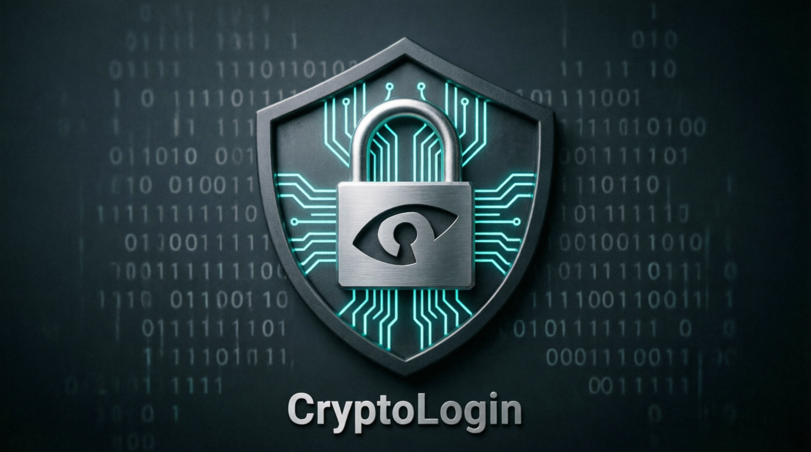

<div align="center">

# 

## _Zero-Knowledge Authentication System_

**The Future of Authentication is Here. No Email. No Password. Just Your Secret.**

[](https://www.python.org/)
[](LICENSE)
[](https://pypi.org/project/cryptologin/1.0.0/)
[](https://github.com/erabytse/CryptoLogin/actions)
[](SECURITY.md)
[](https://github.com/yourusername/cryptologin)

## The time is now ripe for it


</div>

---

## 🚀 What is CryptoLogin?

**CryptoLogin** is a revolutionary **zero-knowledge authentication system** that eliminates the need for emails, passwords, or social logins.

### The Problem

- 🔓 Passwords are **stolen** daily
- 📧 Email verification is **slow** and **annoying**
- 🕵️‍♂️ Social logins **track** your users
- 💰 Authentication services are **expensive**

### The Solution

- 🔐 **One Master Secret** - All you need to remember
- 🛡️ **Military-Grade Encryption** - AES-256-GCM + Argon2id
- 🚫 **Zero-Knowledge** - Your secret never leaves your device
- ⚡ **Lightning Fast** - Register in seconds

---

## ✨ Key Features

| Feature                  | Description                    | Security          |
| :----------------------- | :----------------------------- | :---------------- |
| **Zero-Knowledge**       | Server never knows your secret | 🔒 **Military**   |
| **No Email Required**    | Register without email         | 🔒 **Privacy**    |
| **No Password Required** | Single master secret           | 🔒 **Simple**     |
| **AES-256-GCM**          | NIST standard encryption       | 🔒 **FIPS**       |
| **Argon2id**             | Memory-hard KDF                | 🔒 **OWASP**      |
| **SecureBuffer**         | Automatic memory wiping        | 🔒 **Military**   |
| **Data Vault**           | Encrypted user data            | 🔒 **Zero-Trust** |
| **REST API**             | FastAPI + OpenAPI              | 🔒 **Modern**     |
| **Rate Limiting**        | Brute-force protection         | 🔒 **Production** |

---

## 📦 Installation

```bash
# Install from PyPI
pip install cryptologin

# Or install from source
git clone https://github.com/erabytse/CryptoLogin.git
cd cryptologin
pip install -e .
```

🚀 Quick Start

```python
from cryptologin import CryptoLogin

# Initialize the system
auth = CryptoLogin()

# Register a user
user_id = auth.register(
    master_secret="my-super-secret-64-characters-minimum",
    user_data={"name": "John Doe", "email": "john@example.com"}
)

# Login
challenge = auth.login_init(master_secret)
session = auth.login_verify(master_secret, challenge)

# Access user data
data = auth.get_user_data(user_id, master_secret)
print(data)  # {"name": "John Doe", "email": "john@example.com"}
```

## 🏗️ Architecture

```text
┌─────────────────────────────────────────────────────────────────┐
│ CRYPTOLOGIN                                                     │
├─────────────────────────────────────────────────────────────────┤
│                                                                 │
│ [USER] → [API] → [UserManager] → [Data Vault] → [Storage]       │
│                                                                 │
│ 🔐 AES-256-GCM + Argon2id + SecureBuffer                       |
│ 🚫 Zero-Knowledge Architecture                                 |
│ ⚡ FastAPI + SQLite/PostgreSQL                                 |
│                                                                 │
└─────────────────────────────────────────────────────────────────┘
```

## 🔒 Security Model

How It Works

```text
1. User creates a Master Secret
2. Secret is NEVER sent to the server
3. Server only stores:
   - User ID (derived from secret)
   - Challenge (encrypted with secret)
   - Vault Data (encrypted with secret)
4. Authentication via Challenge-Response
5. All data encrypted with AES-256-GCM
```

Security Certifications

| Standard      | Compliance        |
| ------------- | ----------------- |
| NIST FIPS 197 | ✅ AES-256        |
| OWASP ASVS    | ✅ Argon2id       |
| GDPR          | ✅ Zero-Knowledge |
| SOC2          | ✅ Audit Logs     |
|               |

📊 Comparison

| Feature              | CryptoLogin | Auth0  | Firebase | Clerk  |
| -------------------- | ----------- | ------ | -------- | ------ |
| Zero-Knowledge       | ✅          | ❌     | ❌       | ❌     |
| No Email Required    | ✅          | ❌     | ❌       | ❌     |
| No Password Required | ✅          | ❌     | ❌       | ❌     |
| Open Source          | ✅          | ❌     | ❌       | ❌     |
| Self-Hosted          | ✅          | ❌     | ❌       | ❌     |
| Military Encryption  | ✅          | ⚠️     | ⚠️       | ⚠️     |
| Price                | 💰Free      | 💰💰💰 | 💰💰     | 💰💰💰 |

🎯 Use Cases

- 🌐 Web Applications - Authentication without email/password

- 📱 Mobile Apps - Simple, secure login

- 🔒 Enterprise Apps - Zero-trust authentication

- 🏥 Healthcare - GDPR compliant authentication

- 💳 Fintech - High-security authentication

#

📚 Documentation

- API Reference

- Getting Started Guide

- Security Whitepaper

- Architecture Overview

#

🤝 Contributing

We welcome contributions! Please see our Contributing Guide.

Development Setup

```bash
# Clone the repository
git clone https://github.com/erabytse/CryptoLogin.git
cd cryptologin

# Install dev dependencies
pip install -e .[dev]

# Run tests
pytest tests/ -v

# Run the API
python run.py
```

#

📄 License

- Open Source: Apache 2.0

- Commercial: Available for enterprise use

#

🌟 Support the Project

- ⭐ Star the repository

- 🐛 Report issues

- 📝 Improve documentation

- 💰 Sponsor the project

- 🗣️ Spread the word

#

📞 Contact

- 📧 Email: contact@fbfconsulting.org

- 🐦 Twitter: @cryptologin

- 💬 Discord: Join our community

#

<div align="center">
Built with ❤️ by Erabytse

Reinventing Authentication. One Secret at a Time.

A quiet rebellion against digital waste.

</div>
